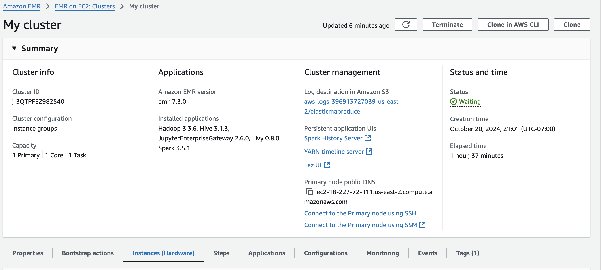
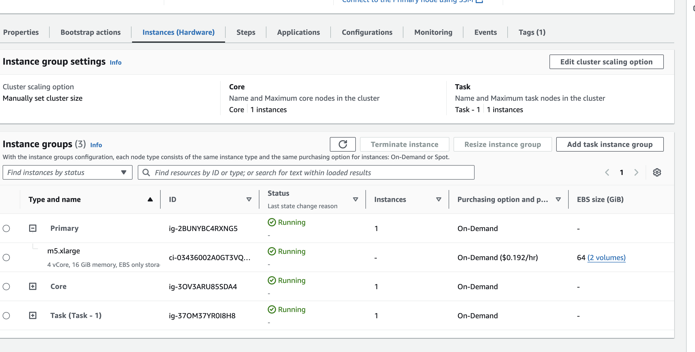
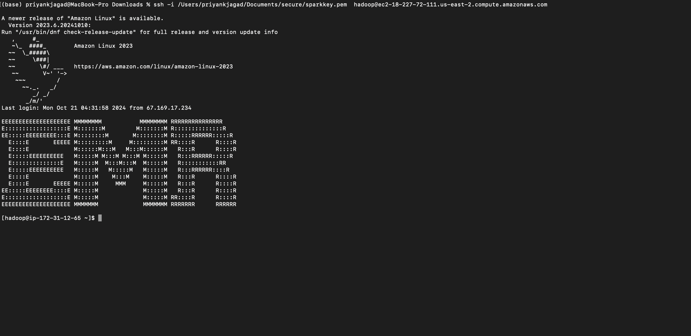
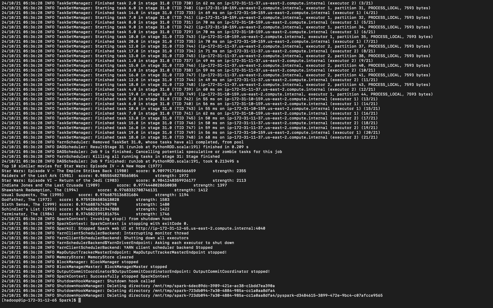

 # Movie Similarity with Apache Spark on EMR

This project calculates movie similarities based on user ratings using Apache Spark's distributed computing power. The script runs on an Amazon EMR cluster with multiple nodes, where each node processes a portion of the data to compute the cosine similarity between pairs of movies.

## Overview

The goal of this project is to compute the cosine similarity between pairs of movies based on user ratings and return the most similar movies for a given movie. The dataset used for this task is the MovieLens dataset.

The script does the following:
1. Loads the movie names and ratings data from HDFS.
2. Processes the ratings data to find all movie pairs that have been rated by the same user.
3. Filters out duplicate pairs of movies.
4. Computes the cosine similarity for each pair of movies.
5. Filters and displays the top 10 most similar movies to a given movie, based on a similarity threshold.

## Prerequisites

- **Amazon EMR cluster** with:
  - Spark installed
  - Multiple EC2 instances (one master, multiple core nodes)
  - HDFS configured and running
- **Python 3** and **PySpark** installed
- **MovieLens Dataset** (placed in HDFS):
  - `movies.dat`: Contains movie names and IDs
  - `ratings.dat`: Contains user ratings for movies




## EMR Cluster Setup

1. **Create an EMR cluster** using the AWS Management Console or CLI. 
    - Ensure that Spark is selected as the application.
    - Use at least one master node and multiple core nodes to distribute the workload.

2. **Upload data to HDFS** on the EMR cluster:
    - Place `movies.dat` and `ratings.dat` in HDFS under `/user/hadoop/`:
      ```bash
      hadoop fs -put movies.dat /user/hadoop/
      hadoop fs -put ratings.dat /user/hadoop/
      ```

3. **Run the Spark script** on the EMR cluster. The script reads the data from HDFS and distributes the computations among the nodes.

## Script Details

### Functions

- `loadMovieNames()`: Loads the movie names from `movies.dat` in HDFS.
- `makePairs(userRatings)`: Creates pairs of movies that have been rated by the same user.
- `filterDuplicates(userRatings)`: Ensures that the same movie pair is not counted twice.
- `computeCosineSimilarity(ratingPairs)`: Calculates the cosine similarity between two movies based on their ratings.

### Workflow

1. **Load Movie Data**: The movie names and ratings are loaded from HDFS.
2. **Create Movie Pairs**: Ratings are grouped by users, and all pairs of movies rated by the same user are created.
3. **Filter Duplicate Pairs**: Removes duplicate movie pairs to avoid redundant calculations.
4. **Cosine Similarity Calculation**: Cosine similarity is calculated for each pair of movies based on user ratings.
5. **Top Similar Movies**: Filters and sorts the most similar movies to a given movie based on the similarity score and the number of co-occurrences.

### Running the Script

To execute the script on your EMR cluster, use the following command:

```bash
spark-submit movie-similarities-1m.py <movieID>
```


